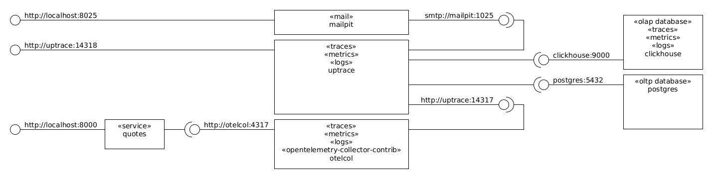

# TODO

**this is currently broken with the following uptrace error (tracked at https://github.com/uptrace/uptrace/issues/403):**

```plain
error	metrics/init.go:43	initSpanMetrics failed	{"error": "createSpanMetric \"uptrace_tracing_events\" failed: createMatView failed: DB::Exception: Column s.count is not under aggregate function and not in GROUP BY keys.
```

The full error is:

```plain
uptrace-1  | [ch]  17:21:14.510   CREATE VIEW            6.62ms  CREATE MATERIALIZED VIEW "metrics_uptrace_tracing_events_mv" TO uptrace.datapoint_minutes AS SELECT s.project_id, 'uptrace_tracing_events' AS metric, toStartOfMinute(s.time) AS time, 'counter' AS instrument, xxHash64(arrayStringConcat([toString(s."system"), toString(s."group_id"), toString(s."name"), toString(s."host_name")], '-')) AS attrs_hash, ['_system', '_group_id', '_name', 'host_name'] AS string_keys, [toString(s."system"), toString(s."group_id"), toString(s."name"), toString(s."host_name")] AS string_values, toJSONString(map('display_name', toString(any(s."display_name")))) AS annotations, s."count" AS sum FROM uptrace.spans_index AS s WHERE (s.type IN ('message', 'other-events') = 1) GROUP BY s.project_id, toStartOfMinute(s.time), toString(s."system"), toString(s."group_id"), toString(s."name"), toString(s."host_name") SETTINGS allow_experimental_analyzer = 1 	  *ch.Error: DB::Exception: Column s.count is not under aggregate function and not in GROUP BY keys. In query SELECT s.project_id, 'uptrace_tracing_events' AS metric, toStartOfMinute(s.time) AS time, 'counter' AS instrument, xxHash64(arrayStringConcat([toString(s.system), toString(s.group_id), toString(s.name), toString(s.host_name)], '-')) AS attrs_hash, ['_system', '_group_id', '_name', 'host_name'] AS string_keys, [toString(s.system), toString(s.group_id), toString(s.name), toString(s.host_name)] AS string_values, toJSONString(map('display_name', toString(any(s.display_name)))) AS annotations, s.count AS sum FROM uptrace.spans_index AS s WHERE (s.type IN ('message', 'other-events')) = 1 GROUP BY s.project_id, toStartOfMinute(s.time), toString(s.system), toString(s.group_id), toString(s.name), toString(s.host_name) SETTINGS allow_experimental_analyzer = 1 (215) 
uptrace-1  | 2024-07-31T17:21:14.510Z	error	metrics/init.go:43	initSpanMetrics failed	{"error": "createSpanMetric \"uptrace_tracing_events\" failed: createMatView failed: DB::Exception: Column s.count is not under aggregate function and not in GROUP BY keys. In query SELECT s.project_id, 'uptrace_tracing_events' AS metric, toStartOfMinute(s.time) AS time, 'counter' AS instrument, xxHash64(arrayStringConcat([toString(s.system), toString(s.group_id), toString(s.name), toString(s.host_name)], '-')) AS attrs_hash, ['_system', '_group_id', '_name', 'host_name'] AS string_keys, [toString(s.system), toString(s.group_id), toString(s.name), toString(s.host_name)] AS string_values, toJSONString(map('display_name', toString(any(s.display_name)))) AS annotations, s.count AS sum FROM uptrace.spans_index AS s WHERE (s.type IN ('message', 'other-events')) = 1 GROUP BY s.project_id, toStartOfMinute(s.time), toString(s.system), toString(s.group_id), toString(s.name), toString(s.host_name) SETTINGS allow_experimental_analyzer = 1 (215)"}
uptrace-1  | github.com/uptrace/uptrace/pkg/metrics.Init
uptrace-1  | 	github.com/uptrace/uptrace/pkg/metrics/init.go:43
uptrace-1  | main.init.func2
uptrace-1  | 	github.com/uptrace/uptrace/cmd/uptrace/main.go:143
uptrace-1  | github.com/urfave/cli/v2.(*Command).Run
uptrace-1  | 	github.com/urfave/cli/v2@v2.27.1/command.go:279
uptrace-1  | github.com/urfave/cli/v2.(*Command).Run
uptrace-1  | 	github.com/urfave/cli/v2@v2.27.1/command.go:272
uptrace-1  | github.com/urfave/cli/v2.(*App).RunContext
uptrace-1  | 	github.com/urfave/cli/v2@v2.27.1/app.go:337
uptrace-1  | github.com/urfave/cli/v2.(*App).Run
uptrace-1  | 	github.com/urfave/cli/v2@v2.27.1/app.go:311
uptrace-1  | main.main
uptrace-1  | 	github.com/uptrace/uptrace/cmd/uptrace/main.go:75
uptrace-1  | runtime.main
uptrace-1  | 	runtime/proc.go:271
```

# About

This is a [OpenTelemetry](https://github.com/open-telemetry/opentelemetry-dotnet)/[Uptrace Community Edition (Uptrace CE)](https://github.com/uptrace/uptrace)/[ClickHouse](https://github.com/ClickHouse/ClickHouse)/[PostgreSQL](https://github.com/postgres/postgres)/[.NET](https://opentelemetry.io/docs/languages/net/) playground.

The following components are used:



# Usage (Ubuntu 22.04)

```bash
# recreate the environment defined in the compose.yml file and leave it running
# in the background.
docker compose --profile tool down --remove-orphans --volumes --timeout=0
docker compose down --remove-orphans --volumes --timeout=0
docker compose --progress plain up -d --build

# show running containers.
docker compose ps

# show logs.
docker compose logs

# open a container network interface in wireshark.
./wireshark.sh quotes

# open the quotes service swagger.
xdg-open http://localhost:8000/swagger

# make a request.
http \
  --verbose \
  http://localhost:8000/quote

# make a failing request.
http \
  --verbose \
  http://localhost:8000/quote?opsi=opsi

# make a request that includes a parent trace.
# NB the dotnet trace id will be set to the traceparent trace id.
# NB the tracestate does not seem to be stored or propagated anywhere.
http \
  --verbose \
  http://localhost:8000/quote \
  traceparent:00-f1f1f1f1f1f1f1f1f1f1f1f1f1f1f1f1-2f2f2f2f2f2f2f2f-01 \
  tracestate:x.client.state=example

# open uptrace.
xdg-open http://localhost:14318

# open mailpit (email).
xdg-open http://localhost:8025

# open the clickhouse playground and dashboard.
xdg-open http://localhost:8123/play
xdg-open http://localhost:8123/dashboard

# show the postgres schema.
docker compose exec -T postgres psql -U uptrace uptrace <<'EOF'
\dt+ public.*
\d+ public.*
EOF
docker compose exec -T postgres pg_dump -U uptrace --schema-only uptrace

# show the clickhouse schema.
# see https://clickhouse.com/docs/en/operations/system-tables
# see https://clickhouse.com/docs/en/interfaces/formats
docker compose exec -T clickhouse clickhouse client --database uptrace --multiline --multiquery <<'EOF'
--show databases;
--show tables;
--select name from system.databases;
select name, create_table_query from system.tables where database='uptrace' format Vertical;
--select table, name, type from system.columns where database='uptrace';
EOF

# show the clickhouse schema (shows more details than the above flavor).
# NB there is no built-in way to dump the schema like postgres with
#    pg_dump --schema-only, instead, we have to create a schema-only backup,
#    with clickhouse-backup --schema, and dump that.
#    see https://github.com/ClickHouse/ClickHouse/issues/60681
#    see https://github.com/ClickHouse/ClickHouse/discussions/60382
docker compose run --rm clickhouse-backup create --schema schema-dump
docker compose run --rm clickhouse-backup list
docker compose exec -T clickhouse find /var/lib/clickhouse/backup/schema-dump -type f -exec cat {} \; | jq
docker compose run --rm clickhouse-backup delete local schema-dump

# destroy the environment.
docker compose --profile tool down --remove-orphans --volumes --timeout=0
docker compose down --remove-orphans --volumes --timeout=0
```

# Notes

* .NET uses the [Activity class](https://docs.microsoft.com/en-us/dotnet/api/system.diagnostics.activity?view=net-8.0) to encapsulate the [W3C Trace Context](https://www.w3.org/TR/trace-context/).
  * The Activity `Id` property contains to the [W3C `traceparent` header value](https://www.w3.org/TR/trace-context/#traceparent-header).
    * It looks alike `00-98d483b6d0e3a6d012b11e23737faa50-6ac18089ab13c12e-01`.
    * It has four fields: `version`, `trace-id`, `parent-id` (aka `span-id`), and `trace-flags`.

# Reference

* [W3C Trace Context](https://www.w3.org/TR/trace-context/).
* [opentelemetry-dotnet repository](https://github.com/open-telemetry/opentelemetry-dotnet).
* [OpenTelemetry in .NET documentation](https://opentelemetry.io/docs/languages/net/).
* [OpenTelemetry.Exporter.OpenTelemetryProtocol Environment Variables](https://github.com/open-telemetry/opentelemetry-dotnet/tree/main/src/OpenTelemetry.Exporter.OpenTelemetryProtocol#environment-variables).
* [Uptrace docker example](https://github.com/uptrace/uptrace/tree/master/example/docker)
